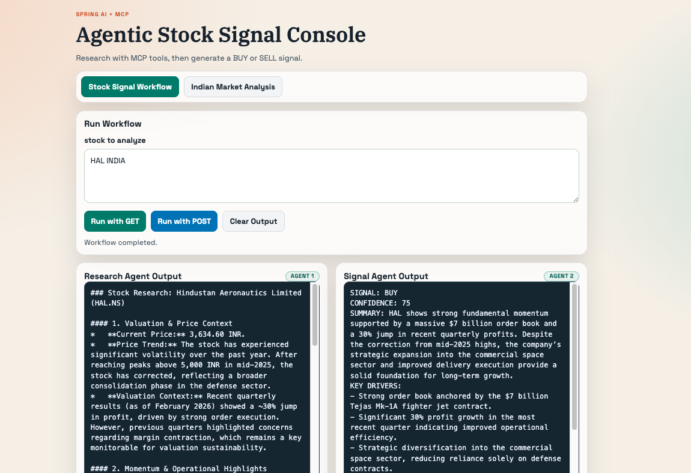

# Spring AI Gemini WebFlux Example

This project is a Spring Boot WebFlux application that uses Spring AI with the Google Gemini Developer API.

It includes two simple agents:

- `Research Agent`: gathers notes for the user request and can use Yahoo Finance MCP tools when enabled.
- `Signal Agent`: turns those notes into a final BUY/SELL-style signal response.

## Requirements

- Java 21+
- Gradle 8+
- A Gemini API key from Google AI Studio
- `uv` / `uvx` if you want to run the Yahoo Finance MCP server locally

## Configuration

Set these environment variables before running:

```bash
export GOOGLE_API_KEY=your-google-api-key
export GEMINI_MODEL=gemini-2.0-flash
```

Optional Yahoo Finance MCP setup:

```bash
export MCP_YAHOO_ENABLED=true
export MCP_YAHOO_COMMAND=uvx
export MCP_YAHOO_PACKAGE=mcp-yahoo-finance
```

When enabled, Spring AI starts the `mcp-yahoo-finance` MCP server over STDIO and exposes its tools to the research agent.

## Run

```bash
gradle bootRun
```

## Test the API

GET request:

```bash
curl "http://localhost:8080/api/agents/run?task=HAL india"
```

POST request:

```bash
curl -X POST "http://localhost:8080/api/agents/run" \
  -H "Content-Type: application/json" \
  -d '{"task":"Summarize Tesla stock context and turn it into an investor-friendly brief"}'
```

## UI Documentation

The app also includes a browser UI at:

`http://localhost:8080`

### Workflow Tab (Stock Signal Workflow)

- `stock to analyze`: input box for the stock prompt/task.
- `Run with GET`: runs workflow via `GET /api/agents/run?task=...`.
- `Run with POST`: runs workflow via `POST /api/agents/run`.
- `Clear Output`: clears current research/signal output areas.
- `Research Agent Output`: raw/structured research collected by the research agent.
- `Signal Agent Output`: final recommendation text from the signal agent.
- `MCP Tools In Use`: loaded MCP tools from `GET /api/agents/mcp/tools`.

### Indian Market Analysis Tab

- `Analyze Indian Market`: runs `GET /api/agents/india/analysis`.
- `India Research Output`: market-wide research context.
- `Top 5 Buy Recommendations`: final list of suggested stocks.

### UI Screenshot



## Notes

- The app uses one Gemini model with two different `ChatClient` personas.
- The endpoint returns both the research output and the signal output so you can see the two-agent workflow.
- It does not use Vertex AI. It uses the Google Gemini Developer API through Spring AI's Google GenAI starter.
- Yahoo Finance MCP is optional and is connected through Spring AI's MCP client starter.
